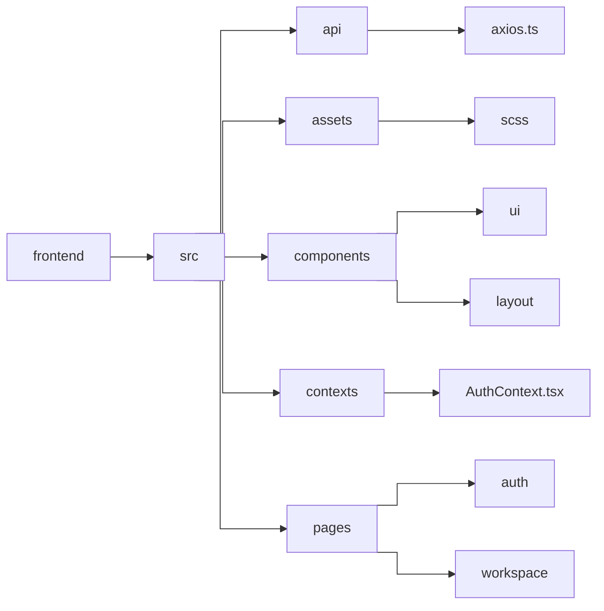
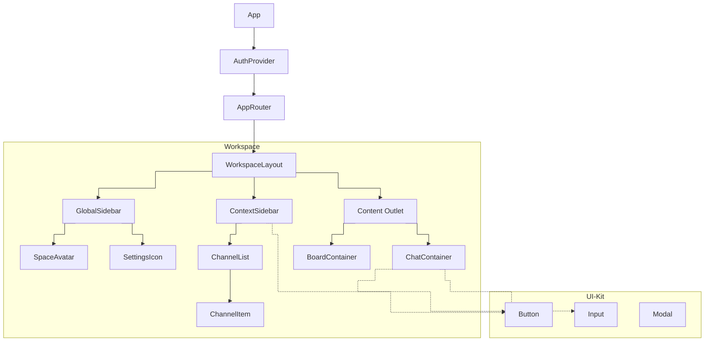

```mermaid
%%{init: {"flowchart": {"curve": "step"}}}%%
flowchart LR
    frontend --> src
    
    src --> api
    api --> axios.ts
    
    src --> assets
    assets --> scss
    
    src --> components
    components --> ui
    components --> layout
    
    src --> contexts
    contexts --> AuthContext.tsx
    
    src --> pages
    pages --> auth
    pages --> workspace
```

```mermaid
%%{init: {"flowchart": {"curve": "step"}}}%%
flowchart TD
    App --> AuthProvider
    AuthProvider --> AppRouter
    
    AppRouter --> WorkspaceLayout
    
    subgraph UI-Kit
        Button
        Input
        Modal
    end
    
    subgraph Workspace
        WorkspaceLayout --> GlobalSidebar
        WorkspaceLayout --> ContextSidebar
        WorkspaceLayout --> Outlet[Content Outlet]
        
        GlobalSidebar --> SpaceAvatar
        GlobalSidebar --> SettingsIcon
        
        ContextSidebar --> ChannelList
        ChannelList --> ChannelItem
        
        Outlet --> ChatContainer
        Outlet --> BoardContainer
    end
    
    %% Демонстрація перевикористання UI-кіта
    ChatContainer -.-> Input
    ChatContainer -.-> Button
    ContextSidebar -.-> Button
```